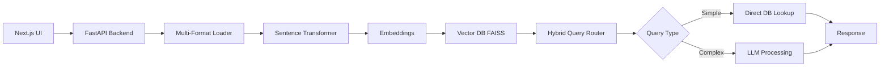

# 🚀 Multi-Format RAG Chatbot

<div align="center">

**Cost-Optimized RAG Chatbot for Large-Scale Document Analysis**

[](https://www.python.org/downloads/)
[](https://fastapi.tiangolo.com/)
[](https://nextjs.org/)
[](LICENSE)

</div>

---

## 📖 Overview

A high-performance, cost-optimized Retrieval-Augmented Generation (RAG) chatbot engineered to **extract, process, and query data from multiple document formats**, scalable to handle billions of data points. Upload PDFs, Excel files, Word documents, CSVs, text files, or JSON—and chat with your data instantly.

By leveraging a sophisticated hybrid query processing system, it intelligently routes user requests to either direct database lookups for factual data retrieval or to powerful Large Language Models (LLMs) for complex, inferential questions. This approach minimizes computational overhead and API costs while delivering fast, accurate responses.

## 📁 Supported File Formats

<table align="center">
<tr>
<td align="center">📄 <strong>PDF</strong></td>
<td align="center">📊 <strong>Excel</strong> (.xlsx)</td>
<td align="center">📝 <strong>Word</strong> (.docx)</td>
</tr>
<tr>
<td align="center">📋 <strong>CSV</strong></td>
<td align="center">📃 <strong>Text</strong> (.txt)</td>
<td align="center">🔧 <strong>JSON</strong></td>
</tr>
</table>

**Upload any supported file and instantly start querying your data with natural language!**

## ✨ Key Features

- **📂 Universal Document Processing**: Automatically extracts and processes data from PDFs, Excel spreadsheets, Word documents, CSVs, text files, and JSON—all through a single unified interface

- **🔥 Massive Scalability**: Architected to handle datasets with up to 1 billion parameters or entries using a streaming parser that processes data in chunks without loading entire files into memory

- **🧠 Hybrid Query Processing**: Smart query router analyzes incoming questions:
  - Simple, fact-based queries → Direct database lookups (instant results)
  - Complex, contextual queries → LLM processing (intelligent reasoning)
  - Drastically reduces reliance on expensive LLM APIs

- **💰 Cost-Effective**: Minimizes LLM interactions, significantly lowering operational costs and making large-scale data analysis accessible

- **⚡ High Performance**: Direct database queries for simple questions provide instant answers for a large class of inquiries

- **🔍 Intelligent Data Extraction**: Uses LangChain loaders optimized for each file type to ensure accurate data extraction and processing

## 🏗️ Architecture



### System Components

The application is composed of two main parts:

#### **Backend** (`src` directory)
Built with Python and FastAPI for robust, high-performance API handling

| File | Purpose |
|------|---------|
| `main.py` | Main entry point defining all API endpoints (file upload, chat) |
| `app.py` | FastAPI application configuration and setup |
| `api.py` | API route definitions and handlers |
| `data_loader.py` | Multi-format document loader supporting PDF, Excel, Word, CSV, TXT, JSON |
| `embedding.py` | Handles text embedding generation using Sentence Transformers |
| `vectorstore.py` | Vector database management and similarity search with FAISS |
| `retriever.py` | Retrieves relevant documents based on query embeddings |
| `search.py` | Search functionality and query optimization |
| `rag_pipeline.py` | Core RAG orchestration and workflow management |

**Key Backend Components:**
- **data_loader.py**: Unified loader supporting PyPDF, Excel, Word, CSV, TXT, and JSON formats
- **embedding.py**: Generates vector embeddings using Sentence Transformers
- **vectorstore.py**: FAISS-based vector storage for fast similarity search
- **retriever.py**: Intelligent document retrieval based on semantic similarity
- **rag_pipeline.py**: Orchestrates the entire RAG workflow from query to response

#### **Frontend** (`rag-chatbot-ui` directory)
Modern, responsive UI built with Next.js and React

| Component | Purpose |
|-----------|---------|
| `app/page.tsx` | Primary chat interface component with drag-and-drop file upload |
| `components/` | Reusable React UI components |
| `package.json` | Frontend dependencies and scripts |

## 🚀 Getting Started

### Prerequisites

- Python 3.8+
- Node.js and npm (or pnpm/yarn)
- OpenAI API key (or compatible LLM provider)

### Backend Setup

1. **Navigate to the project root directory**

2. **Create and activate a virtual environment:**
   ```bash
   python -m venv venv
   source venv/bin/activate  # On Windows: venv\Scripts\activate
   ```

3. **Install Python dependencies:**
   ```bash
   pip install -r requirements.txt
   # OR if using pyproject.toml
   pip install -e .
   ```

   **Required packages include:**
   - `fastapi`
   - `uvicorn`
   - `langchain`
   - `langchain-community`
   - `sentence-transformers`
   - `faiss-cpu` (or `faiss-gpu` for GPU support)
   - `pypdf`
   - `python-docx`
   - `openpyxl`
   - `unstructured`
   - `openai`

4. **Configure environment variables:**
   
   Create a `.env` file in the root directory:
   ```env
   OPENAI_API_KEY=your-openai-api-key
   DATA_DIR=./data
   ```

5. **Run the backend server:**
   ```bash
   # From the Backend/src directory
   python main.py
   # OR
   uvicorn src.main:app --reload
   ```

   The API will be available at `http://127.0.0.1:8000`

### Frontend Setup

> **Note:** Frontend UI is currently in development. The backend API is fully functional and can be tested using tools like Postman, curl, or the included Jupyter notebooks.

1. **Navigate to the frontend directory:**
   ```bash
   cd rag-chatbot-ui
   ```

2. **Install Node.js dependencies:**
   ```bash
   npm install
   ```

3. **Configure frontend environment:**
   
   Create a `.env.local` file in the `rag-chatbot-ui` directory:
   ```env
   NEXT_PUBLIC_API_URL=http://127.0.0.1:8000
   ```

4. **Run the development server:**
   ```bash
   npm run dev
   ```

   The UI will be available at `http://localhost:3000`

## 🌐 Deployment

The project is configured for deployment on **Vercel** with automated build processes.

### Deployment Steps

1. Push your code to a Git repository (GitHub, GitLab, Bitbucket)
2. Connect your repository to Vercel
3. Configure environment variables in Vercel project settings:
   - `OPENAI_API_KEY`
   - `NEXT_PUBLIC_API_URL`
   - `DATA_DIR`
   - Any other required secrets

The `vercel.json` configuration file and `vercel_build.sh` script handle the deployment process automatically.

## 🛠️ Tech Stack

**Backend:**
- FastAPI
- LangChain (Document loaders and processing)
- Sentence Transformers
- FAISS (Vector Database)
- Python 3.8+

**Frontend:**
- Next.js 14+
- React
- TypeScript
- Tailwind CSS

**AI/ML:**
- OpenAI API
- Sentence Transformers for embeddings
- FAISS for vector similarity search

**Document Processing:**
- PyPDF for PDF extraction
- python-docx for Word documents
- openpyxl for Excel files
- unstructured for advanced parsing

## 📊 Usage

### Basic Workflow

1. **Upload Documents**: Drag and drop or select files (PDF, Excel, Word, CSV, TXT, JSON)
2. **Automatic Processing**: The system:
   - Detects file format automatically
   - Extracts text and data using specialized loaders
   - Chunks content intelligently
   - Generates embeddings
   - Stores in vector database
3. **Query Your Data**: Ask questions in natural language
4. **Smart Routing**: The system routes queries optimally:
   - Factual queries → Instant database responses
   - Complex queries → LLM reasoning with context
5. **Get Results**: Receive accurate, contextual answers with source citations

### Example Queries

```
"What are the key findings in the Q4 report?"
"Summarize the data from the sales spreadsheet"
"Find all mentions of 'revenue growth' in the uploaded documents"
"What's the total amount in column B of the Excel file?"
"Extract contact information from the PDF"
```

## 📂 Project Structure

```
QUERYBEAM/
├── .venv/                      # Virtual environment
├── Backend/
│   ├── Agenticrag/             # RAG agent implementation
│   ├── data/                   # Document storage
│   │   ├── pdf/               # PDF files
│   │   ├── text_files/        # Text documents
│   ├── notebook/              # Jupyter notebooks for testing
│   └── src/
│       ├── __init__.py
│       ├── data_loader.py     # Multi-format document loader
│       ├── embedding.py       # Embedding generation
│       ├── vectorstore.py     # Vector database management
│       ├── retriever.py       # Document retrieval logic
│       ├── search.py          # Search functionality
│       ├── rag_pipeline.py    # RAG workflow orchestration
│       ├── api.py             # API route handlers
│       ├── app.py             # FastAPI app configuration
│       └── main.py            # Application entry point
├── .env                        # Environment variables
├── .gitignore
├── .python-version
├── package-lock.json
├── pyproject.toml             # Python project configuration
└── README.md
```

## 🤝 Contributing

Contributions are welcome! Please feel free to submit a Pull Request.

1. Fork the repository
2. Create your feature branch (`git checkout -b feature/AmazingFeature`)
3. Commit your changes (`git commit -m 'Add some AmazingFeature'`)
4. Push to the branch (`git push origin feature/AmazingFeature`)
5. Open a Pull Request

## 📄 License

This project is licensed under the MIT License - see the LICENSE file for details.

## 🙏 Acknowledgments

- FastAPI for the excellent Python web framework
- LangChain for powerful document processing tools
- Sentence Transformers for embedding models
- FAISS for efficient similarity search
- Vercel for seamless deployment

---

<div align="center">

**Built with ❤️ for efficient, scalable document analysis**

*Upload any document. Ask any question. Get instant answers.*

</div>
